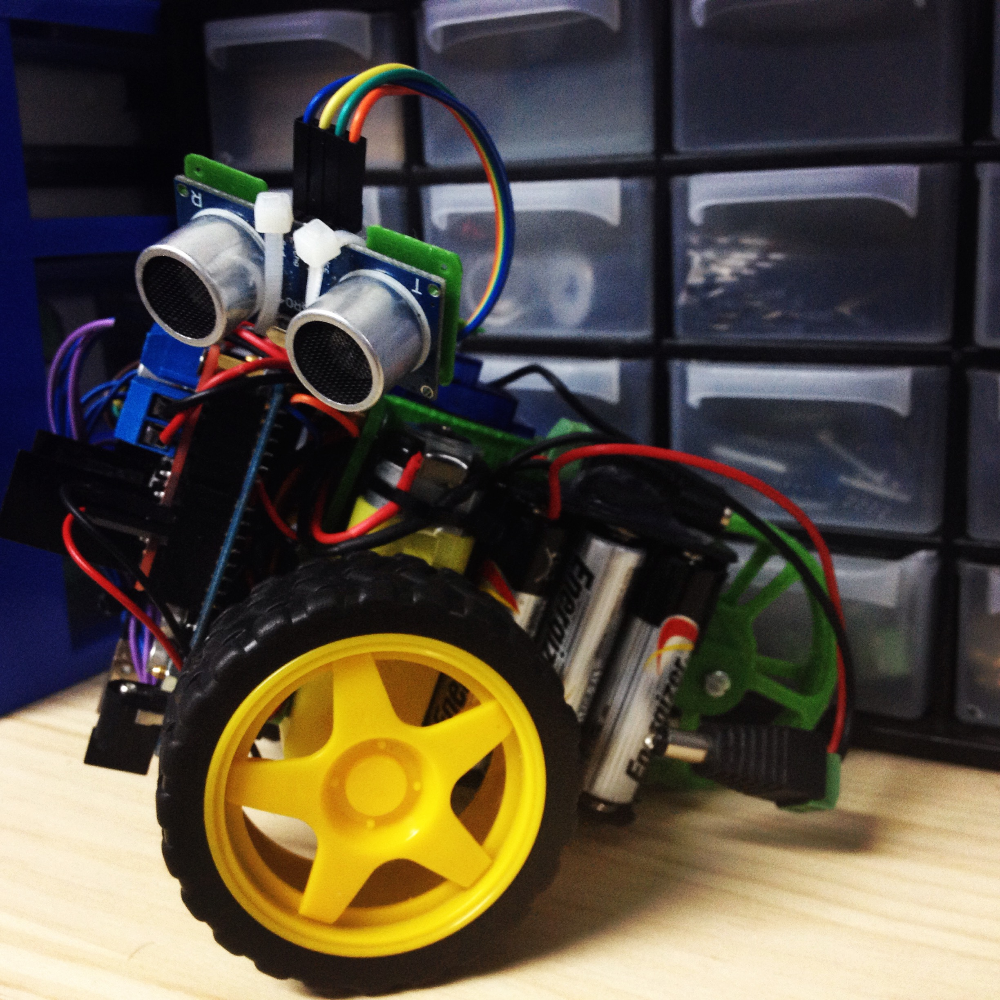

# SCRU-FE

Este repositorio es una mejora del modelo [SCRU-FE: Simple C++ Robot with Ultra-sonic-sensor For Education](http://www.thingiverse.com/thing:780050) de [rtheiss](http://www.thingiverse.com/rtheiss)

### Piezas

Podeis encontrar todas las piezas en la carpeta [piezas](piezas) o [Thingverse](http://www.thingiverse.com/thing:1481809)

### Mejoras

- **Nueva Rueda**
La rueda original ha sido sustituida por una nueva que se compone de las piezas originales y un anillo

- **Código**

El código que podéis encontrar en el repositorio permite al robot esquivar obstáculos. No necesita librerías adicionales

Se basa en ejemplos del [libro interactivo](http://www.practicasconarduino.com/manualrapido/) de [EduBasica](http://www.practicasconarduino.com)

### Licencias

**Código (cc-by-sa)**

- [Más detalles](http://www.practicasconarduino.com/manualrapido/crditos.html)

**Piezas**

- [Más detalles](http://www.thingiverse.com/thing:1481809)